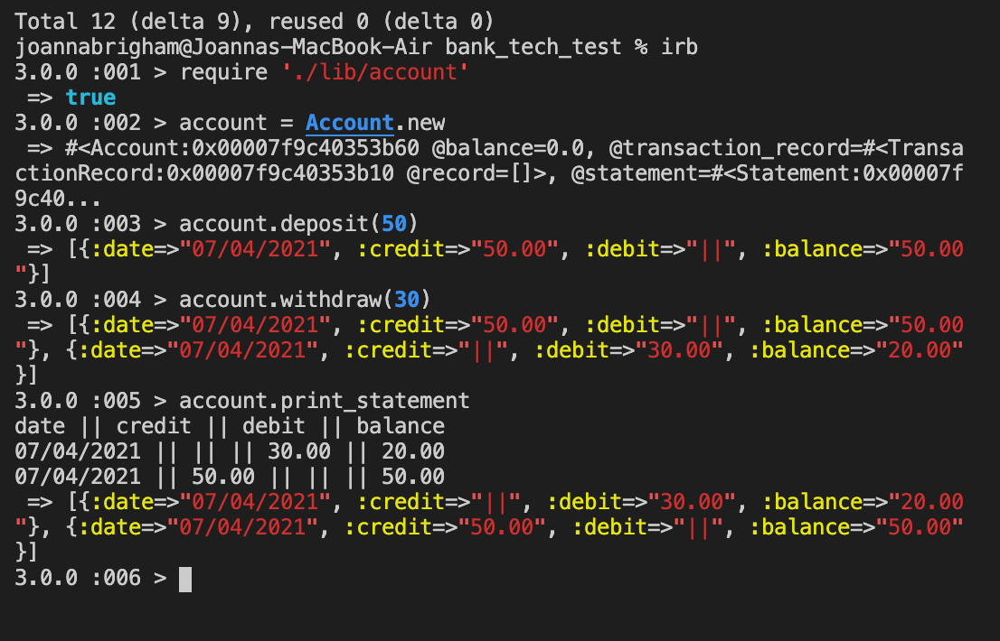
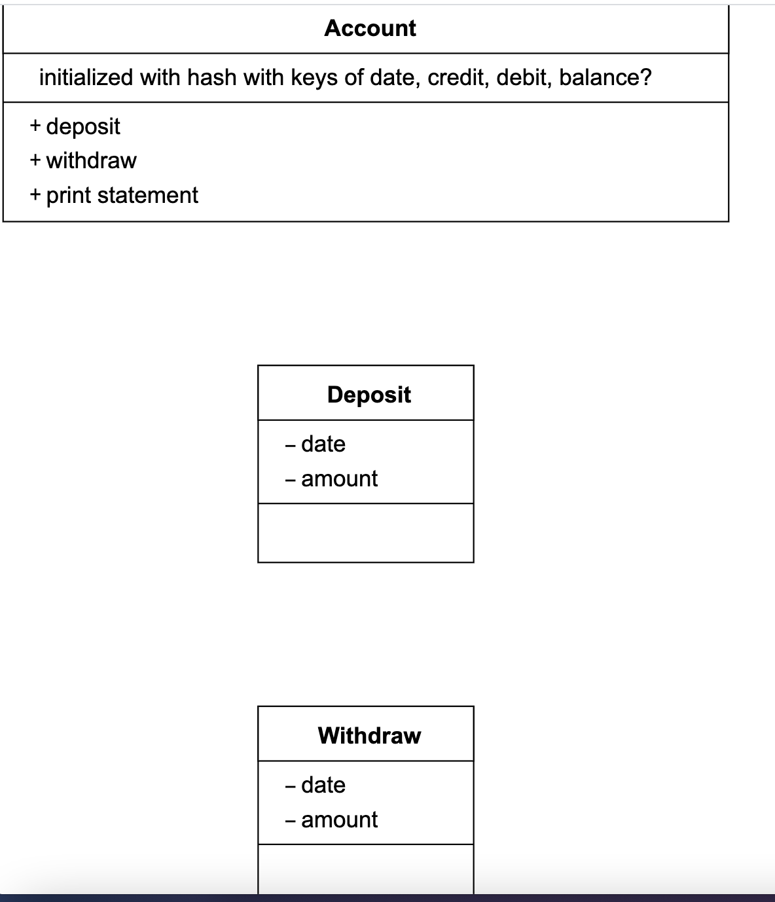

Week 10 of Makers - Practice Tech Test

## Specification

### Requirements

* You should be able to interact with your code via a REPL like IRB or the JavaScript console.  (You don't need to implement a command line interface that takes input from STDIN.)
* Deposits, withdrawal.
* Account statement (date, amount, balance) printing.
* Data can be kept in memory (it doesn't need to be stored to a database or anything).

### Acceptance criteria

**Given** a client makes a deposit of 1000 on 10-01-2012  
**And** a deposit of 2000 on 13-01-2012  
**And** a withdrawal of 500 on 14-01-2012  
**When** she prints her bank statement  
**Then** she would see

```
date || credit || debit || balance
14/01/2012 || || 500.00 || 2500.00
13/01/2012 || 2000.00 || || 3000.00
10/01/2012 || 1000.00 || || 1000.00
```

## Tech/Framework used:

##### Built with:
- Ruby
- Rspec
- Rubocop
- Simplecov

## How to use:

- Clone this repo to your local computer
- Run Bundle to insure you have the relevant Gems
- Run rspec to ensure all tests are passing
- Open IRB
- require './lib/account'

### Here is a screenshot of the app in action




## User Stories

These are the user stories I created from the requirements.

```
As a user,
So I can keep my money safe,
I want to be able to deposit it in my account
```

```
As a user,
So I can spend my money,
I want to be able to withdraw it from my account
```

```
As a user,
So I can keep track of my money,
I want to be able to see a statement with details of my transactions, including date, amount balance
```

## Planning

This was my initial plan for the classes and their methods, as you will see I have deviated from this quite a lot. In future I could benefit from further planning, perhaps writing some pseudocode as I've realised this helps me formulate my ideas. From that I could then create some more detailed class diagrams. 

